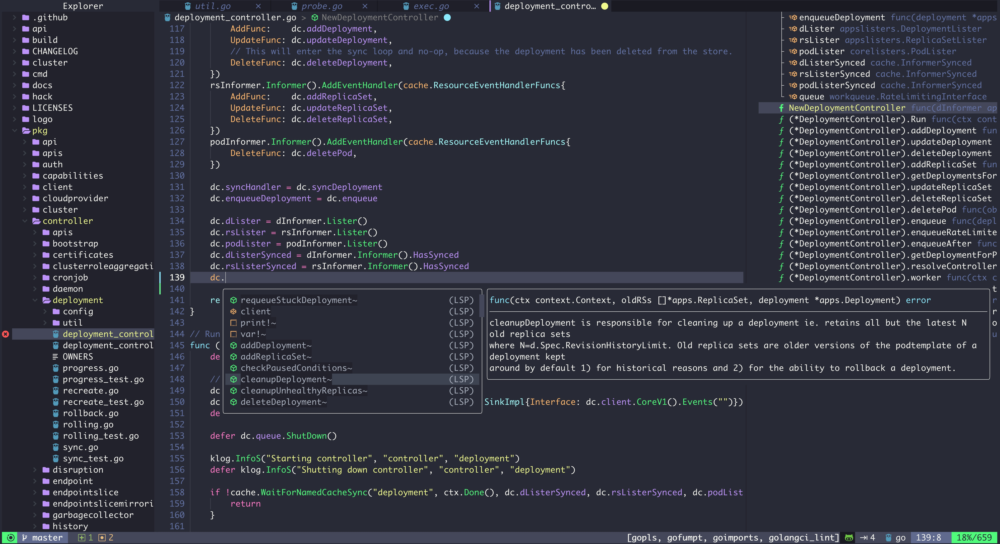

# LunarVim-Config



## 前言

[LunarVim](https://www.lunarvim.org/) 是一个面向 NeoVim 的社区驱动的配置框架,它内置了一份实用的插件集合和默认配置,可以让你开箱即用的享受类似 IDE 的编码体验,在这份配置之上,你可以定制一些增强功能,这就是本项目的由来,在 LunarVim 配置之上,我还添加了以下功能:
* 更多实用插件
* 更多自定义代码片段(Snippet)
* 更强大的 which-key 按键提示
* 更炫酷的界面 UI
* 对 NeoVide 的支持
* 更丰富的编码体验

## 安装

首先你需要安装[LunarVim (release-1.3/neovim-0.9 及以上版本)](https://www.lunarvim.org/docs/installation)，安装依赖包括:

1. [neovim-0.9](https://github.com/neovim/neovim/releases)或以上版本
2. [git](https://git-scm.com/downloads)
3. [python pip](https://pip.pypa.io/en/stable/installation/)
4. [nodejs npm](https://www.npmjs.com/)
5. [rust cargo](https://www.rust-lang.org/)(可选，你可以手动安装 ripgrep 和 fd-find)

```sh
LV_BRANCH='release-1.3/neovim-0.9' bash <(curl -s https://raw.githubusercontent.com/LunarVim/LunarVim/release-1.3/neovim-0.9/utils/installer/install.sh)
```

然后，安装本配置:

```sh
# backup original config
mv ~/.config/lvim{,.bak}
# install my config
git clone https://github.com/elliotxx/lunarvim-config ~/.config/lvim
# install all plugins
lvim --headless -c 'autocmd User PackerComplete quitall' -c 'PackerSync'
```

`lvim`是 LunarVim 官方提供的启动脚本，可以与原来的配置隔离开来。

## 功能介绍

### 目录结构

```txt
lvim/
    config.lua          配置入口和一些 LunarVim 内建配置
    lua/user/
        plugin.lua      插件加载
        keybinding.lua  快捷键定义
        neovim.lua      neovim 原生配置
        alpha.lua       alpha 启动页面配置，包含大量字符画
        statusline.lua  lualine 状态栏配置
        treesitter.lua  treesitter 相关配置
    snippets/
        go.json         go 语言代码片段
        pakcage.json    snippets 配置文件
```

## 感谢 🙏
* [mrbeardad/MyLunarVim](https://github.com/mrbeardad/MyLunarVim)
